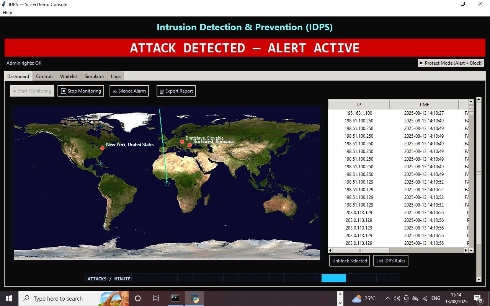

# Sci-Fi-Intrusion-Detection-Prevention-System-IDPS-
A real-time Intrusion Detection &amp; Prevention System with a cinematic, sci-fi control-room interface. Detects cyberattacks, blocks malicious IPs, sounds alarms, and visualizes threats on a world map just like in the movies.

# Program Interface 

# 🎯 # Features
 Real-time Attack Detection  — monitors logs or simulated events.

Auto IP Blocking — firewall integration to drop malicious IPs instantly.

Looping Siren Alarm — continuous until the last active threat is cleared.

World Map Visualization — attacker location marked with a red dot.

# Configurable Controls:

Threshold & block time

Whitelist critical IPs

Protect Mode: Alert-only or Alert+Block

Attack Simulation Dashboard — generate port scans and failed login attempts for testing.

Stats & Charts — attacks per minute graph with history.

Scrollable Dashboard — view map, table, and charts even on smaller screens.

# Movie Vibe Enhancements:

Dark neon theme

Animated pulsing alert banners

“About Us” info panel

# 🛠 Installation
Prerequisites
Python 3.8+
pip installed
OS: Windows / Linux (firewall blocking requires admin/root privileges)

1. Clone Repository
bash
git clone https://github.com/ArcRobot-Researchcenter/Sci-Fi-Intrusion-Detection-Prevention-System-IDPS

2. Install Dependencies
   
bash
pip install -r requirements.txt

4. Run the Program
bash
python IDPS.py

# 🚀 How to Run the Program
You can run the IDPS in two main ways — from the command line or by double-clicking the script.
Option 1 — Run from Command Line
Open Command Prompt (Windows) or Terminal (Linux/Mac).

# Open Command Prompt as Administrator.

Go to your folder
Navigate to the project folder:
bash
cd "C:\Users\YOURNAME\path\to\IDPS.py
"
Start the program:
bash
python IDPS.py

# ⚙ Configuration
Threshold — Number of suspicious events before triggering an alert.

Block Time — How long an IP stays blocked (seconds).

Whitelist — Prevents blocking of trusted IPs.

Simulator — Generate fake attacks to test system behavior.

# 🧪 Simulation
You can simulate attacks without affecting your real network:

Go to Simulator tab

Select attack type (e.g., Port Scan)

Set IP and number of attempts

Click Simulate

👤 About Developer
Developer: Abdulrahaman Raji
Company: Arc Robotics
Website: https://academicprojectworld.com/
Email: rajialex433@gmail.com

